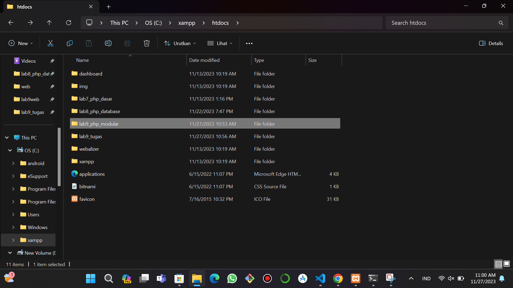
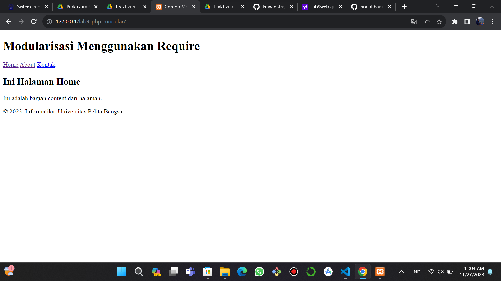

| Nama      | Muhammad Din Al Ayubi |
| ----------- | ----------- |
| NIM     | 312210293       |
| Kelas   | TI.22.A.3        |
# Lab9web
## Instruksi Praktikum
1. Persiapkan text editor misalnya VSCode.
2. Buat folder baru dengan nama lab9_php_modular pada docroot webserver(htdocs)
3. Ikuti langkah-langkah praktikum
## Jalankan XAMPP dan akses ```http://localhost/phpmyadmin/``` untuk membuat database.

## Buat file ```lab9_php_modular``` pada root directory web server ```(c:\xampp\htdocs)```

## Buat file baru dengan nama ```header.php```
```python
<!DOCTYPE html>
<html lang="en">
<head>
    <meta charset="UTF-8">
    <title>Contoh Modularisasi</title>
    <link href="style.css" rel="stylesheet" type="text/stylesheet"media="screen" />
</head>
<body>
    <div class="container">
        <header>
            <h1>Modularisasi Menggunakan Require</h1>
        </header>
        <nav>
            <a href="home.php">Home</a>
            <a href="about.php">About</a>
            <a href="kontak.php">Kontak</a>
        </nav>
```
## Buat file baru dengan nama ```footer.php```
```python
<footer>
    <p>&copy; 2023, Informatika, Universitas Pelita Bangsa</p>
</footer>
</div>
</body>
</html>
```
## Buat file baru dengan nama ```home.php```
```python
<?php require('header.php'); ?>

<div class="content">
    <h2>Ini Halaman Home</h2>
    <p>Ini adalah bagian content dari halaman.</p>
</div>

<?php require('footer.php'); ?>
```
## Buat file baru dengan nama ```about.php```
```python
<?php require('header.php'); ?>

<div class="content">
    <h2>Ini Halaman About</h2>
    <p>Ini adalah bagian content dari halaman.</p>
</div>

<?php require('footer.php'); ?>
```
## Output


## Pertanyaan dan Tugas
## Implementasikan konsep modularisasi pada kode program praktikum 8 tentang database, sehingga setiap halamannya memiliki template tampilan yang sama. Laporan Praktikum
## Buat file ```lab9_tugas``` pada root directory web server ```(c:\xampp\htdocs)```

## Buat file baru dengan nama ```koneksi.php```
```python
<?php
$host = "localhost";
$user = "root";
$pass = "";
$db = "latihan1";
$conn = mysqli_connect($host, $user, $pass, $db);
if ($conn == false)
{
  echo "Koneksi ke server gagal.";
  die();
} #else echo "Koneksi berhasil";
?>
```
## Buat file baru dengan nama ```index.php```
```python
<?php
include("koneksi.php");

$sql = 'SELECT * FROM data_barang';
$result = mysqli_query($conn, $sql);

?>
<DOCTYPE html>
<html lang="en">
<head>
    <meta charset="UTF-8">
    <link href="style.css" rel="stylesheet" type="text/css" />
    <title>Data Barang</title>
</head>
<body>
    <div class="container">
        <h1>Data Barang</h1>
        <tr>
            <a href="tambah.php?id=">Tambah Barang</a>
        </tr>

        <div class="main">
            <table border="1" cellpadding="5" cellspacing="0">
            <tr>
                <th>Gambar</th>
                <th>Nama Barang</th>
                <th>Katagori</th>
                <th>Harga Jual</th>
                <th>Harga Beli</th>
                <th>Stok</th>
                <th>Aksi</th>
            </tr>
            <?php if($result): ?>
            <?php while($row = mysqli_fetch_array($result)): ?>
            <tr>
                <td><?= $row['nama'];?></td>
                <td><?= $row['nama'];?></td>
                <td><?= $row['kategori'];?></td>
                <td><?= $row['harga_beli'];?></td>
                <td><?= $row['harga_jual'];?></td>
                <td><?= $row['stok'];?></td>
                <td>
                    <a href="ubah.php?id=<?= $row['id_barang'];?>">Ubah</a>
                    <a href="hapus.php?id=<?= $row['id_barang'];?>">Hapus</a>
                </td>
            </tr>
            <?php endwhile; else: ?>
            <tr>
                <td colspan="7">Belum ada data</td>
            </tr>
            <?php endif; ?>
            </table>
        </div>
    </div>
</body>
</html>
```
## Output

## Buat file baru dengan nama ```tambah.php```
```python
<?php
error_reporting(E_ALL);
include_once 'koneksi.php';

if (isset($_POST['submit']))
{
    $nama = $_POST['nama'];
    $kategori = $_POST['kategori'];
    $harga_jual = $_POST['harga_jual'];
    $harga_beli = $_POST['harga_beli'];
    $stok = $_POST['stok'];
    $file_gambar = $_FILES['file_gambar'];
    $gambar = null;
    if ($file_gambar['error'] == 0)
    {
        $filename = str_replace(' ', '_',$file_gambar['name']);
        $destination = dirname(__FILE__) .'/gambar/' . $filename;
        if(move_uploaded_file($file_gambar['tmp_name'], $destination))
        {
            $gambar = 'gambar/' . $filename;;
        }
    }
    $sql = 'INSERT INTO data_barang (nama, kategori,harga_jual, harga_beli, stok, gambar) ';
    $sql .= "VALUE ('{$nama}', '{$kategori}','{$harga_jual}', '{$harga_beli}', '{$stok}', '{$gambar}')";
    $result = mysqli_query($conn, $sql);
    header('location: index.php');
}
?>
<!DOCTYPE html>
<html lang="en">
<head>
    <meta charset="UTF-8">
    <meta http-equiv="X-UA-Compatible" content="IE=edge">
    <meta name="viewport" content="width=device-width, initial-scale=1.0">
    <title>Tambah Barang</title>
</head>
<body>
    <div class="container">
        <h1>Tambah Barang</h1>
    <div class="main">
        <form method="post" action="tambah.php" enctype="multipart/form-data">
            <table border="0" align="left">
                <tr>
                    <div class="input">
                        <td>Nama Barang</td>
                        <td>:</td>
                        <td><input type="text" name="nama" /></td>
                    </div>
                </tr>
                <div class="input">
                    <td>Kategori</td>
                    <td>:</td>
                    <td><select name="kategori">
                        <option value="Komputer">Komputer</option>
                        <option value="Elektronik">Elektronik</option>
                        <option value="Hand Phone">Hand Phone</option>
                        </select>
                    </td>
                </div>
                </tr>
                <div class="input">
                    <td>Harga Jual</td>
                    <td>:</td>
                    <td><input type="text" name="harga_jual" /></td>
                </div>    
                </tr>
                <div class="input">
                    <td>Harga Beli</td>
                    <td>:</td>
                    <td><input type="text" name="harga_beli" /></td>
                </div>  
                </tr>
                <div class="input">
                    <td>Stok</td>
                    <td>:</td>
                    <td><input type="text" name="stok" /></td>
                </div>
                </tr>
                <div class="input">
                    <td>File Gambar</td>
                    <td>:</td>
                    <td><input type="file" name="file_gambar" /></td>
                </div>
                </tr>
                <div class="submit">
                    <td><input type="submit" name="submit" value="Simpan" /></td>
                </div>
                </tr>
            </table>
        </form>
    </div>
    </div>
</body>
</html>
```
## Output


## Buat file baru dengan nama ```ubah.php```
```python
<?php
error_reporting(E_ALL);
include_once 'koneksi.php';
if (isset($_POST['submit']))
{
	$id = $_POST['id'];
	$nama = $_POST['nama'];
	$kategori = $_POST['kategori'];
	$harga_jual = $_POST['harga_jual'];
	$harga_beli = $_POST['harga_beli'];
	$stok = $_POST['stok'];
	$file_gambar = $_FILES['file_gambar'];
	$gambar = null;
 
	if ($file_gambar['error'] == 0)
	{
		$filename = str_replace(' ', '_', $file_gambar['name']);
		$destination = dirname(__FILE__) . '/gambar/' . $filename;
		if (move_uploaded_file($file_gambar['tmp_name'], $destination))
		{
			$gambar = 'gambar/' . $filename;;
		}
	}
	$sql = 'UPDATE data_barang SET ';
	$sql .= "nama = '{$nama}', kategori = '{$kategori}', ";
	$sql .= "harga_jual = '{$harga_jual}', harga_beli = '{$harga_beli}', stok 
= '{$stok}' ";
	if (!empty($gambar))
		$sql .= ", gambar = '{$gambar}' ";
	$sql .= "WHERE id_barang = '{$id}'";
	$result = mysqli_query($conn, $sql);
	
	header('location: index.php');
}

$id = $_GET['id'];
$sql = "SELECT * FROM data_barang WHERE id_barang = '{$id}'";
$result = mysqli_query($conn, $sql);
if (!$result) die('Error: Data tidak tersedia');
$data = mysqli_fetch_array($result);

function is_select($var, $val) {
 if ($var == $val) return 'selected="selected"';
 return false;
}

?>
<!DOCTYPE html>
<html lang="en">
<head>
	<meta charset="UTF-8">
	<link href="style.css" rel="stylesheet" type="text/css" />
	<title>Ubah Barang</title>
</head>
<body>
<div class="container">
	<h1>Ubah Barang</h1>
	<div class="main">
		<form method="post" action="ubah.php"
enctype="multipart/form-data">
			<div class="input">
				<label>Nama Barang</label>
				<input type="text" name="nama" value="<?php echo 
$data['nama'];?>" />
			</div>
			<div class="input">
	 			<label>Kategori</label>
				<select name="kategori">
	 				<option <?php echo is_select
('Komputer', $data['kategori']);?> value="Komputer">Komputer</option>
	 				<option <?php echo is_select
('Komputer', $data['kategori']);?> value="Elektronik">Elektronik</option>
 					<option <?php echo is_select
('Komputer', $data['kategori']);?> value="Hand Phone">Hand Phone</option>
				</select>
			</div>
			<div class="input">
				<label>Harga Jual</label>
				<input type="text" name="harga_jual" value="<?php echo 
$data['harga_jual'];?>" />
			</div>
			<div class="input">
				<label>Harga Beli</label>
				<input type="text" name="harga_beli" value="<?php echo 
$data['harga_beli'];?>" />
			</div>
			<div class="input">
				<label>Stok</label>
				<input type="text" name="stok" value="<?php echo 
$data['stok'];?>" />
			</div>
			<div class="input">
				<label>File Gambar</label>
				<input type="file" name="file_gambar" />
			</div>
			<div class="submit">
				<input type="hidden" name="id" value="<?php echo 
$data['id_barang'];?>" />
				<input type="submit" name="submit" value="Simpan" />
			</div>
		</form>
	</div>
</div>
</body>
</html>
```
## Output


## Buat file baru dengan nama ```Hapus.php```
```python
<?php
include_once 'koneksi.php';
$id = $_GET['id'];
$sql = "DELETE FROM data_barang WHERE id_barang = '{$id}'";
$result = mysqli_query($conn, $sql);
header('location: index.php');
?>
```

## Buat file baru dengan nama ```style.css```
```python
/* import google font */
@import
url('https://fonts.googleapis.com/css2?family=Open+Sans:ital,wght@0,300;0,400;0,600;0,700;0,800;1,300;1,400;1,600;1,700;1,800&display=swap');
@import
url('https://fonts.googleapis.com/css2?family=Open+Sans+Condensed:ital,wght@0,300;0,700;1,300&display=swap');

/* Reset CSS */
* {
    margin: 0;
    padding: 0;
}
body {
    line-height:1;
    font-size:100%;
    font-family:'Open Sans', sans-serif;
    color:#5a5a5a;
}
#container {
    width: 980px;
    margin: 0 auto;
    box-shadow: 0 0 1em #cccccc;
}

/* header */
header {
    padding: 20px;
}
header h1 {
    margin: 20px 10px;
    color: #b5b5b5;
}

/* navigasi */
nav {
    display: block;
    background-color: #1f5faa;
}
nav a {
    padding: 15px 30px;
    display: inline-block;
    color: #ffffff;
    font-size: 14px;
    text-decoration: none;
    font-weight: bold;
}
nav a.active,
nav a:hover {
    background-color: #2b83ea;
}

/* Content Panel */
.content {
    background-color: #e4e4e5;
    padding: 50px 20px;
    margin-bottom: 20px;
}
.content h1 {
    margin-bottom: 20px;
    font-size: 35px;
}
.content p {
    margin-bottom: 20px;
    font-size: 18px;
    line-height: 25px;
}

/* footer */
footer {
    clear:both;
    background-color:#1d1d1d;
    padding:20px;
    color:#eee;
}

/* tabel */
body{
    font-family: sans-serif;
}
table{
    border-collapse: collapse;
}
th, td{
    border: 1px solid black;
    font-size: 16px;
    padding: 7px 9px;
}
table th {
    background:#1f5faa;
    color:#DCDCDC;
    font-weight:bold;
    font-size:14px;
}
table tr:nth-child(even) {
    background:#F0F8FF;
}

/* Tambah Barang */
.input{
    padding: 5px;
}
```
1. Buatlah repository baru dengan nama Lab9Web.
2. Kerjakan semua latihan yang diberikan sesuai urutannya.
3. Screenshot setiap perubahannya.
4. Buatlah file README.md dan tuliskan penjelasan dari setiap langkah praktikum beserta screenshotnya.
5. Commit hasilnya pada repository masing-masing.
6. Kirim URL repository pada e-learning ecampus
